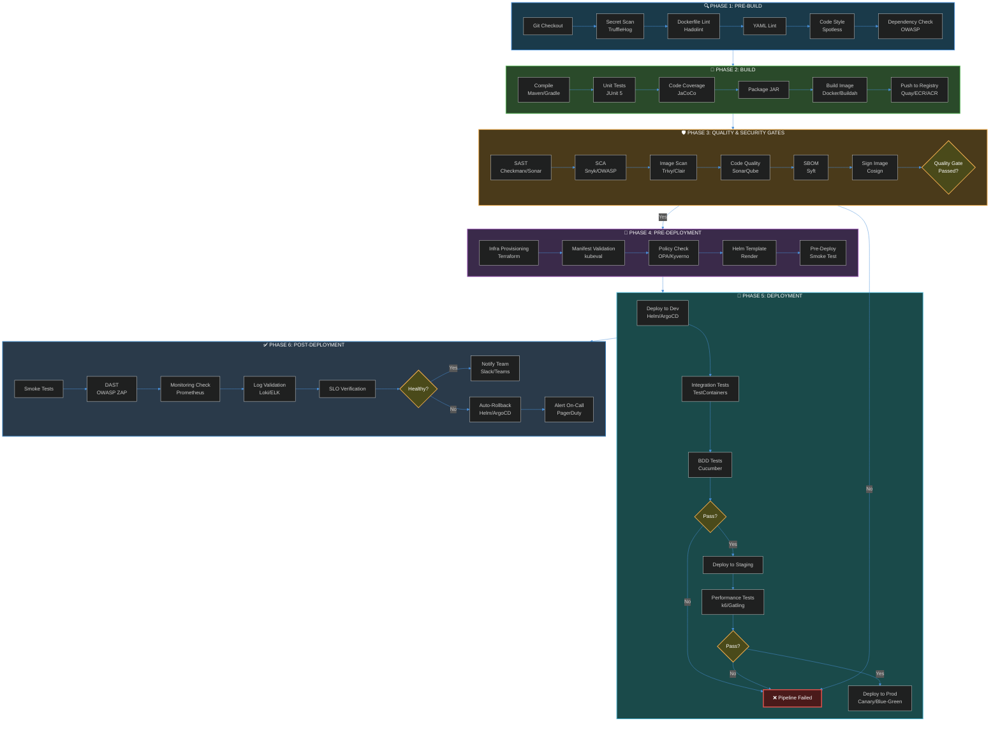

> **From Workspace Structure to Production Pipeline — A Battle-Tested Blueprint for Java Microservices**

---

## Table of Contents
1. [The Big Picture](#1-the-big-picture)
2. [Workspace Structure](#2-workspace-structure)
3. [The CI/CD Pipeline](#3-the-cicd-pipeline)
   - Phase 1: Pre-Build
   - Phase 2: Build
   - Phase 3: Post-Build / Quality Gates
   - Phase 4: Pre-Deployment
   - Phase 5: Deployment
   - Phase 6: Post-Deployment
4. [Helm Chart Structure](#4-helm-chart-structure)
5. [Pipeline Configuration](#5-pipeline-configuration)
6. [Testing Strategy](#6-testing-strategy)
7. [Security & Quality Gates](#7-security--quality-gates)
8. [Quick Start Checklist](#8-quick-start-checklist)
9. [Complete Pipeline Diagram](#9-complete-pipeline-diagram)
{: .toc}

---

## 1. The Big Picture

Deploying Java services to Kubernetes or OpenShift isn't just about writing a `Dockerfile` and running `kubectl apply`. It's about creating a **repeatable, secure, observable pipeline** that takes code from a developer's laptop to a production cluster with confidence.

This guide provides a **production-grade blueprint** that covers:
- Workspace organization
- CI/CD pipeline stages
- Helm-based deployments
- Security scanning (SCA, SAST, DAST)
- Code quality gates
- Testing at every layer

---

## 2. Workspace Structure

A well-organized workspace is the foundation. Here's the recommended structure for a Java microservice:

```
my-java-service/
├── .github/                          # GitHub Actions workflows (or .tekton/ for OpenShift)
│   └── workflows/
│       └── pipeline.yaml
├── helm/
│   └── my-java-service/
│       ├── Chart.yaml
│       ├── values.yaml
│       ├── values-dev.yaml
│       ├── values-staging.yaml
│       ├── values-prod.yaml
│       └── templates/
│           ├── _helpers.tpl
│           ├── deployment.yaml
│           ├── service.yaml
│           ├── ingress.yaml
│           ├── hpa.yaml
│           ├── serviceaccount.yaml
│           ├── configmap.yaml
│           ├── secret.yaml
│           └── pdb.yaml
├── src/
│   ├── main/
│   │   ├── java/
│   │   │   └── com/company/service/
│   │   │       ├── MyJavaServiceApplication.java
│   │   │       ├── config/
│   │   │       ├── controller/
│   │   │       ├── service/
│   │   │       ├── repository/
│   │   │       ├── model/
│   │   │       ├── dto/
│   │   │       ├── mapper/
│   │   │       ├── exception/
│   │   │       └── security/
│   │   └── resources/
│   │       ├── application.yml
│   │       ├── application-dev.yml
│   │       ├── application-staging.yml
│   │       ├── application-prod.yml
│   │       ├── logback-spring.xml
│   │       └── db/migration/         # Flyway/Liquibase migrations
│   └── test/
│       ├── java/
│       │   └── com/company/service/
│       │       ├── unit/             # JUnit 5 unit tests
│       │       ├── integration/      # @SpringBootTest integration tests
│       │       └── bdd/              # Cucumber BDD tests
│       └── resources/
│           ├── application-test.yml
│           ├── features/             # Cucumber .feature files
│           └── wiremock/             # WireMock stubs
├── Dockerfile
├── Dockerfile.multistage
├── skaffold.yaml                     # Local dev with Skaffold
├── pom.xml                           # Maven
├── build.gradle                      # Gradle (alternative)
├── lombok.config
├── .editorconfig
├── .gitignore
├── README.md
└── docs/
    ├── ARCHITECTURE.md
    ├── RUNBOOK.md
    └── API.md
```

### Key Principles
- **Separation of Concerns**: Helm charts live in `helm/`, source in `src/`, pipelines in `.github/` or `.tekton/`
- **Environment-Specific Configs**: `values-*.yaml` and `application-*.yml` for each environment
- **Test Organization**: Clear separation between unit, integration, and BDD tests

---

## 3. The CI/CD Pipeline

### Phase 1: Pre-Build 🔍

| Step | Tool | Purpose |
|------|------|---------|
| **Checkout** | Git | Pull source code |
| **Secrets Scan** | GitLeaks / TruffleHog | Detect committed secrets |
| **Lint Dockerfile** | Hadolint | Validate Dockerfile best practices |
| **Lint YAML** | yamllint | Validate Helm charts and K8s manifests |
| **Lint Code** | Checkstyle / Spotless | Enforce Java code style |
| **Dependency Validation** | OWASP Dependency-Check | Early vulnerability detection |

### Phase 2: Build 🔨

| Step | Tool | Purpose |
|------|------|---------|
| **Compile** | Maven / Gradle | Build the application |
| **Unit Tests** | JUnit 5 + Mockito | Fast, isolated tests |
| **Code Coverage** | JaCoCo | Measure test coverage |
| **Package JAR** | Maven / Gradle | Create executable artifact |
| **Build Image** | Docker / Buildah | Create container image |
| **Push to Registry** | JFrog / Quay / ECR / ACR | Store image artifact |

### Phase 3: Post-Build / Quality Gates 🛡️

| Step | Tool | Purpose |
|------|------|---------|
| **SAST** | Checkmarx / SonarQube / Semgrep | Static Application Security Testing |
| **SCA** | Snyk / OWASP Dependency-Check / Mend | Software Composition Analysis |
| **Image Scan** | Trivy / Clair / Snyk Container | Scan container images for CVEs |
| **Code Quality** | SonarQube | Code smells, duplication, coverage gate |
| **SBOM Generation** | Syft / Trivy | Generate Software Bill of Materials |
| **Sign Image** | Cosign / Notary | Cryptographically sign the image |

### Phase 4: Pre-Deployment 🚦

| Step | Tool | Purpose |
|------|------|---------|
| **Environment Provisioning** | Terraform / Crossplane | Ensure infrastructure exists |
| **Config Validation** | kubeval / kubeconform | Validate K8s manifests |
| **Policy Check** | OPA / Kyverno | Enforce security policies |
| **Helm Template Render** | Helm | Preview rendered manifests |
| **Smoke Test (Pre-Deploy)** | curl / newman | Verify target environment health |

### Phase 5: Deployment 🚀

| Step | Tool | Purpose |
|------|------|---------|
| **Deploy to Dev** | Helm / ArgoCD / Flux | Deploy to development cluster |
| **Integration Tests** | TestContainers + RestAssured | Test against real dependencies |
| **BDD Tests** | Cucumber + Selenium/Playwright | User journey validation |
| **Promote to Staging** | ArgoCD / GitOps | GitOps-based promotion |
| **Performance Tests** | k6 / JMeter / Gatling | Load and stress testing |
| **Promote to Prod** | ArgoCD / Manual Gate | Production deployment |
| **Canary / Blue-Green** | Flagger / Argo Rollouts | Progressive delivery |

### Phase 6: Post-Deployment ✅

| Step | Tool | Purpose |
|------|------|---------|
| **Smoke Tests** | curl / newman | Verify deployment health |
| **DAST** | OWASP ZAP | Dynamic Application Security Testing |
| **Monitoring Validation** | Prometheus queries | Verify metrics are flowing |
| **Log Validation** | Loki / ELK | Check for errors in logs |
| **SLO Verification** | Prometheus + SLOs | Confirm service level objectives |
| **Rollback (if needed)** | Helm rollback / ArgoCD | Automated rollback on failure |
| **Notification** | Slack / Teams / PagerDuty | Alert team of deployment status |

---

## 4. Helm Chart Structure

### `Chart.yaml`
```yaml
apiVersion: v2
name: my-java-service
description: A Helm chart for my Java microservice
type: application
version: 1.0.0
appVersion: "1.0.0"
dependencies:
  - name: postgresql
    version: 12.x.x
    repository: https://charts.bitnami.com/bitnami
    condition: postgresql.enabled
```

### `values.yaml` (Base)
```yaml
replicaCount: 2

image:
  repository: quay.io/company/my-java-service
  pullPolicy: IfNotPresent
  tag: ""  # Set by CI pipeline

service:
  type: ClusterIP
  port: 8080
  targetPort: 8080

ingress:
  enabled: true
  className: nginx
  annotations:
    cert-manager.io/cluster-issuer: letsencrypt-prod
  hosts:
    - host: my-service.company.com
      paths:
        - path: /
          pathType: Prefix

resources:
  limits:
    cpu: 1000m
    memory: 1Gi
  requests:
    cpu: 250m
    memory: 512Mi

autoscaling:
  enabled: true
  minReplicas: 2
  maxReplicas: 10
  targetCPUUtilizationPercentage: 70
  targetMemoryUtilizationPercentage: 80

livenessProbe:
  httpGet:
    path: /actuator/health/liveness
    port: 8080
  initialDelaySeconds: 60
  periodSeconds: 10

readinessProbe:
  httpGet:
    path: /actuator/health/readiness
    port: 8080
  initialDelaySeconds: 30
  periodSeconds: 5

podDisruptionBudget:
  enabled: true
  minAvailable: 1

serviceAccount:
  create: true
  annotations: {}

securityContext:
  runAsNonRoot: true
  runAsUser: 1000
  readOnlyRootFilesystem: true
  allowPrivilegeEscalation: false

env:
  - name: SPRING_PROFILES_ACTIVE
    value: "prod"
  - name: JAVA_OPTS
    value: "-XX:+UseContainerSupport -XX:MaxRAMPercentage=75.0 -XX:+UseG1GC"

configMap:
  enabled: true
  data:
    application.yml: |
      server:
        port: 8080
      management:
        endpoints:
          web:
            exposure:
              include: health,info,metrics,prometheus
        endpoint:
          health:
            probes:
              enabled: true

secrets:
  enabled: true
  data: {}
  # Populated via external secret operator or CI/CD

podAnnotations:
  prometheus.io/scrape: "true"
  prometheus.io/port: "8080"
  prometheus.io/path: "/actuator/prometheus"
```

### `templates/deployment.yaml` (Key Snippet)

```yaml
apiVersion: apps/v1
kind: Deployment
metadata:
  name: {{ include "my-java-service.fullname" . }}
  labels:
    {{- include "my-java-service.labels" . | nindent 4 }}
spec:
  replicas: {{ .Values.replicaCount }}
  strategy:
    type: RollingUpdate
    rollingUpdate:
      maxSurge: 25%
      maxUnavailable: 0
  selector:
    matchLabels:
      {{- include "my-java-service.selectorLabels" . | nindent 6 }}
  template:
    metadata:
      annotations:
        checksum/config: {{ include (print $.Template.BasePath "/configmap.yaml") . | sha256sum }}
        {{- with .Values.podAnnotations }}
        {{- toYaml . | nindent 8 }}
        {{- end }}
      labels:
        {{- include "my-java-service.selectorLabels" . | nindent 8 }}
    spec:
      serviceAccountName: {{ include "my-java-service.serviceAccountName" . }}
      securityContext:
        {{- toYaml .Values.securityContext | nindent 8 }}
      containers:
        - name: {{ .Chart.Name }}
          image: "{{ .Values.image.repository }}:{{ .Values.image.tag | default .Chart.AppVersion }}"
          imagePullPolicy: {{ .Values.image.pullPolicy }}
          ports:
            - name: http
              containerPort: 8080
              protocol: TCP
          env:
            {{- toYaml .Values.env | nindent 12 }}
          envFrom:
            - configMapRef:
                name: {{ include "my-java-service.fullname" . }}
            {{- if .Values.secrets.enabled }}
            - secretRef:
                name: {{ include "my-java-service.fullname" . }}
            {{- end }}
          livenessProbe:
            {{- toYaml .Values.livenessProbe | nindent 12 }}
          readinessProbe:
            {{- toYaml .Values.readinessProbe | nindent 12 }}
          resources:
            {{- toYaml .Values.resources | nindent 12 }}
          volumeMounts:
            - name: tmp
              mountPath: /tmp
      volumes:
        - name: tmp
          emptyDir: {}
```


---

## 5. Pipeline Configuration

### GitHub Actions Example (`.github/workflows/pipeline.yaml`)


```yaml
name: Java Service CI/CD Pipeline

on:
  push:
    branches: [main, develop]
  pull_request:
    branches: [main]

env:
  REGISTRY: quay.io
  IMAGE_NAME: company/my-java-service
  JAVA_VERSION: '21'
  MAVEN_OPTS: "-Dmaven.repo.local=.m2/repository"

jobs:
  # ═══════════════════════════════════════════
  # PHASE 1: PRE-BUILD
  # ═══════════════════════════════════════════
  pre-build:
    name: 🔍 Pre-Build Checks
    runs-on: ubuntu-latest
    steps:
      - name: Checkout Code
        uses: actions/checkout@v4
        with:
          fetch-depth: 0  # Required for SonarQube

      - name: Detect Secrets
        uses: trufflesecurity/trufflehog@main
        with:
          path: ./
          base: main
          head: HEAD

      - name: Lint Dockerfile
        uses: hadolint/hadolint-action@v3.1.0
        with:
          dockerfile: Dockerfile

      - name: Lint YAML
        run: |
          pip install yamllint
          yamllint -d relaxed helm/ .github/

      - name: Setup Java
        uses: actions/setup-java@v4
        with:
          java-version: ${{ env.JAVA_VERSION }}
          distribution: 'temurin'
          cache: 'maven'

      - name: Code Style Check
        run: ./mvnw spotless:check

  # ═══════════════════════════════════════════
  # PHASE 2: BUILD
  # ═══════════════════════════════════════════
  build:
    name: 🔨 Build & Unit Test
    runs-on: ubuntu-latest
    needs: pre-build
    steps:
      - name: Checkout Code
        uses: actions/checkout@v4

      - name: Setup Java
        uses: actions/setup-java@v4
        with:
          java-version: ${{ env.JAVA_VERSION }}
          distribution: 'temurin'
          cache: 'maven'

      - name: Cache Maven Dependencies
        uses: actions/cache@v4
        with:
          path: ~/.m2
          key: ${{ runner.os }}-m2-${{ hashFiles('**/pom.xml') }}
          restore-keys: ${{ runner.os }}-m2

      - name: Compile & Unit Tests
        run: ./mvnw clean verify -P unit-tests

      - name: Generate Coverage Report
        run: ./mvnw jacoco:report

      - name: Upload Coverage
        uses: actions/upload-artifact@v4
        with:
          name: coverage-report
          path: target/site/jacoco/

      - name: Build JAR
        run: ./mvnw package -DskipTests

      - name: Upload JAR Artifact
        uses: actions/upload-artifact@v4
        with:
          name: app-jar
          path: target/*.jar

  # ═══════════════════════════════════════════
  # PHASE 3: CONTAINERIZE & PUSH
  # ═══════════════════════════════════════════
  containerize:
    name: 📦 Containerize
    runs-on: ubuntu-latest
    needs: build
    outputs:
      image_tag: ${{ steps.meta.outputs.tags }}
      image_digest: ${{ steps.build.outputs.digest }}
    steps:
      - name: Checkout Code
        uses: actions/checkout@v4

      - name: Download JAR
        uses: actions/download-artifact@v4
        with:
          name: app-jar
          path: target/

      - name: Setup Docker Buildx
        uses: docker/setup-buildx-action@v3

      - name: Login to Registry
        uses: docker/login-action@v3
        with:
          registry: ${{ env.REGISTRY }}
          username: ${{ secrets.REGISTRY_USERNAME }}
          password: ${{ secrets.REGISTRY_PASSWORD }}

      - name: Extract Metadata
        id: meta
        uses: docker/metadata-action@v5
        with:
          images: ${{ env.REGISTRY }}/${{ env.IMAGE_NAME }}
          tags: |
            type=sha,prefix=,suffix=,format=short
            type=ref,event=branch
            type=semver,pattern={{version}}

      - name: Build & Push Image
        id: build
        uses: docker/build-push-action@v5
        with:
          context: .
          push: true
          tags: ${{ steps.meta.outputs.tags }}
          labels: ${{ steps.meta.outputs.labels }}
          cache-from: type=gha
          cache-to: type=gha,mode=max
          platforms: linux/amd64,linux/arm64

  # ═══════════════════════════════════════════
  # PHASE 4: SECURITY & QUALITY GATES
  # ═══════════════════════════════════════════
  security-gates:
    name: 🛡️ Security & Quality Gates
    runs-on: ubuntu-latest
    needs: containerize
    steps:
      - name: Checkout Code
        uses: actions/checkout@v4
        with:
          fetch-depth: 0

      - name: Setup Java
        uses: actions/setup-java@v4
        with:
          java-version: ${{ env.JAVA_VERSION }}
          distribution: 'temurin'

      - name: SonarQube Scan
        env:
          SONAR_TOKEN: ${{ secrets.SONAR_TOKEN }}
        run: |
          ./mvnw sonar:sonar \
            -Dsonar.projectKey=my-java-service \
            -Dsonar.host.url=${{ secrets.SONAR_HOST }} \
            -Dsonar.coverage.jacoco.xmlReportPaths=target/site/jacoco/jacoco.xml

      - name: SCA Scan (Snyk)
        uses: snyk/actions/maven@master
        env:
          SNYK_TOKEN: ${{ secrets.SNYK_TOKEN }}
        with:
          args: --severity-threshold=high

      - name: Image Scan (Trivy)
        uses: aquasecurity/trivy-action@master
        with:
          image-ref: ${{ env.REGISTRY }}/${{ env.IMAGE_NAME }}:${{ github.sha }}
          format: 'sarif'
          output: 'trivy-results.sarif'

      - name: Upload Trivy Results
        uses: github/codeql-action/upload-sarif@v3
        with:
          sarif_file: 'trivy-results.sarif'

      - name: Generate SBOM
        uses: anchore/sbom-action@v0
        with:
          image: ${{ env.REGISTRY }}/${{ env.IMAGE_NAME }}:${{ github.sha }}
          format: spdx-json
          output-file: sbom.spdx.json

      - name: Sign Image (Cosign)
        uses: sigstore/cosign-installer@v3
      - run: |
          cosign sign --yes \
            ${{ env.REGISTRY }}/${{ env.IMAGE_NAME }}@${{ needs.containerize.outputs.image_digest }}

  # ═══════════════════════════════════════════
  # PHASE 5: DEPLOY TO DEV
  # ═══════════════════════════════════════════
  deploy-dev:
    name: 🚀 Deploy to Dev
    runs-on: ubuntu-latest
    needs: [build, containerize, security-gates]
    environment:
      name: development
      url: https://my-service-dev.company.com
    steps:
      - name: Checkout Code
        uses: actions/checkout@v4

      - name: Setup Helm
        uses: azure/setup-helm@v4

      - name: Setup Kubectl
        uses: azure/setup-kubectl@v3

      - name: Configure Kubeconfig
        run: |
          echo "${{ secrets.KUBECONFIG_DEV }}" | base64 -d > kubeconfig
          export KUBECONFIG=kubeconfig

      - name: Helm Upgrade (Dev)
        run: |
          helm upgrade --install my-java-service ./helm/my-java-service \
            --namespace dev \
            --create-namespace \
            --values ./helm/my-java-service/values.yaml \
            --values ./helm/my-java-service/values-dev.yaml \
            --set image.tag=${{ github.sha }} \
            --wait \
            --timeout 5m

      - name: Smoke Test
        run: |
          kubectl rollout status deployment/my-java-service -n dev --timeout=120s
          curl -sf https://my-service-dev.company.com/actuator/health || exit 1

  # ═══════════════════════════════════════════
  # PHASE 6: INTEGRATION & BDD TESTS
  # ═══════════════════════════════════════════
  integration-tests:
    name: 🔗 Integration & BDD Tests
    runs-on: ubuntu-latest
    needs: deploy-dev
    steps:
      - name: Checkout Code
        uses: actions/checkout@v4

      - name: Setup Java
        uses: actions/setup-java@v4
        with:
          java-version: ${{ env.JAVA_VERSION }}
          distribution: 'temurin'

      - name: Run Integration Tests
        run: ./mvnw verify -P integration-tests -Dspring.profiles.active=dev

      - name: Run BDD Tests
        run: ./mvnw verify -P bdd-tests -Dcucumber.filter.tags="@smoke"

  # ═══════════════════════════════════════════
  # PHASE 7: DEPLOY TO STAGING
  # ═══════════════════════════════════════════
  deploy-staging:
    name: 🚀 Deploy to Staging
    runs-on: ubuntu-latest
    needs: integration-tests
    environment:
      name: staging
      url: https://my-service-staging.company.com
    steps:
      - name: Checkout Code
        uses: actions/checkout@v4

      - name: Helm Upgrade (Staging)
        run: |
          helm upgrade --install my-java-service ./helm/my-java-service \
            --namespace staging \
            --create-namespace \
            --values ./helm/my-java-service/values.yaml \
            --values ./helm/my-java-service/values-staging.yaml \
            --set image.tag=${{ github.sha }} \
            --wait \
            --timeout 5m

      - name: Performance Tests (k6)
        uses: grafana/k6-action@v0.3.1
        with:
          filename: tests/performance/load-test.js

  # ═══════════════════════════════════════════
  # PHASE 8: DEPLOY TO PRODUCTION
  # ═══════════════════════════════════════════
  deploy-prod:
    name: 🚀 Deploy to Production
    runs-on: ubuntu-latest
    needs: deploy-staging
    environment:
      name: production
      url: https://my-service.company.com
    steps:
      - name: Checkout Code
        uses: actions/checkout@v4

      - name: Helm Upgrade (Production)
        run: |
          helm upgrade --install my-java-service ./helm/my-java-service \
            --namespace production \
            --create-namespace \
            --values ./helm/my-java-service/values.yaml \
            --values ./helm/my-java-service/values-prod.yaml \
            --set image.tag=${{ github.sha }} \
            --wait \
            --timeout 10m

      - name: Post-Deploy Smoke Test
        run: |
          kubectl rollout status deployment/my-java-service -n production --timeout=300s
          curl -sf https://my-service.company.com/actuator/health || exit 1

      - name: DAST Scan (OWASP ZAP)
        uses: zaproxy/action-full-scan@v0.9.0
        with:
          target: 'https://my-service.company.com'
          rules_file_name: '.zap/rules.tsv'

      - name: Notify Slack
        uses: 8398a7/action-slack@v3
        with:
          status: ${{ job.status }}
          channel: '#deployments'
        env:
          SLACK_WEBHOOK_URL: ${{ secrets.SLACK_WEBHOOK_URL }}
```


### Tekton/OpenShift Pipelines Example (`.tekton/pipeline.yaml`)

```yaml
apiVersion: tekton.dev/v1beta1
kind: Pipeline
metadata:
  name: java-service-pipeline
spec:
  workspaces:
    - name: shared-workspace
    - name: maven-settings
    - name: docker-config
  params:
    - name: git-url
      type: string
    - name: git-revision
      type: string
      default: main
    - name: image-tag
      type: string
    - name: target-namespace
      type: string
      default: dev
  tasks:
    # Clone
    - name: fetch-source
      taskRef:
        name: git-clone
      workspaces:
        - name: output
          workspace: shared-workspace
      params:
        - name: url
          value: $(params.git-url)
        - name: revision
          value: $(params.git-revision)

    # Maven Build
    - name: maven-build
      taskRef:
        name: maven
      runAfter:
        - fetch-source
      workspaces:
        - name: source
          workspace: shared-workspace
        - name: maven-settings
          workspace: maven-settings
      params:
        - name: GOALS
          value: ["clean", "verify", "-P", "unit-tests"]

    # Buildah Build & Push
    - name: build-image
      taskRef:
        name: buildah
      runAfter:
        - maven-build
      workspaces:
        - name: source
          workspace: shared-workspace
        - name: dockerconfig
          workspace: docker-config
      params:
        - name: IMAGE
          value: image-registry.openshift-image-registry.svc:5000/$(params.target-namespace)/my-java-service:$(params.image-tag)
        - name: TLSVERIFY
          value: "false"

    # Helm Deploy
    - name: helm-deploy
      taskRef:
        name: helm-upgrade-from-source
      runAfter:
        - build-image
      workspaces:
        - name: source
          workspace: shared-workspace
      params:
        - name: charts_dir
          value: helm/my-java-service
        - name: release_name
          value: my-java-service
        - name: release_namespace
          value: $(params.target-namespace)
        - name: overwrite_values
          value: "image.tag=$(params.image-tag)"
```

---

## 6. Testing Strategy

### The Testing Pyramid for Java Services

```
         /\
        /  \   E2E Tests (Cucumber + Selenium/Playwright)
       /    \      ~5% of tests, slow, high confidence
      /------\
     /        \  Integration Tests (TestContainers + RestAssured)
    /          \    ~15% of tests, medium speed
   /------------\
  /              \ Contract Tests (Pact / Spring Cloud Contract)
 /                \  ~10% of tests, fast
/------------------\
/                    \ Unit Tests (JUnit 5 + Mockito)
/______________________\  ~70% of tests, fast, isolated
```

### Unit Tests (`src/test/java/.../unit/`)
```java
@ExtendWith(MockitoExtension.class)
class OrderServiceTest {

    @Mock
    private OrderRepository orderRepository;

    @InjectMocks
    private OrderService orderService;

    @Test
    void shouldCreateOrderSuccessfully() {
        // Given
        OrderRequest request = new OrderRequest("PRODUCT-123", 2);
        when(orderRepository.save(any(Order.class)))
            .thenReturn(new Order("ORDER-456", "PRODUCT-123", 2, OrderStatus.CREATED));

        // When
        OrderResponse response = orderService.createOrder(request);

        // Then
        assertThat(response.getOrderId()).isEqualTo("ORDER-456");
        assertThat(response.getStatus()).isEqualTo(OrderStatus.CREATED);
        verify(orderRepository).save(any(Order.class));
    }
}
```

### Integration Tests (`src/test/java/.../integration/`)
```java
@SpringBootTest(webEnvironment = SpringBootTest.WebEnvironment.RANDOM_PORT)
@Testcontainers
class OrderControllerIntegrationTest {

    @Container
    static PostgreSQLContainer<?> postgres = new PostgreSQLContainer<>("postgres:15-alpine")
        .withDatabaseName("testdb")
        .withUsername("test")
        .withPassword("test");

    @DynamicPropertySource
    static void configureProperties(DynamicPropertyRegistry registry) {
        registry.add("spring.datasource.url", postgres::getJdbcUrl);
        registry.add("spring.datasource.username", postgres::getUsername);
        registry.add("spring.datasource.password", postgres::getPassword);
    }

    @Autowired
    private TestRestTemplate restTemplate;

    @Test
    void shouldCreateOrderAndPersistToDatabase() {
        OrderRequest request = new OrderRequest("PRODUCT-123", 2);

        ResponseEntity<OrderResponse> response = restTemplate.postForEntity(
            "/api/v1/orders", request, OrderResponse.class);

        assertThat(response.getStatusCode()).isEqualTo(HttpStatus.CREATED);
        assertThat(response.getBody()).isNotNull();
        assertThat(response.getBody().getStatus()).isEqualTo(OrderStatus.CREATED);
    }
}
```

### BDD Tests (`src/test/java/.../bdd/`)
```java
@RunWith(Cucumber.class)
@CucumberOptions(
    features = "src/test/resources/features",
    glue = "com.company.service.bdd.steps",
    plugin = {"pretty", "html:target/cucumber-report.html"},
    tags = "@smoke"
)
public class CucumberTestRunner {}

// Step Definition
public class OrderSteps {

    @Given("a product with id {string} exists")
    public void productExists(String productId) {
        // Setup via WireMock or Testcontainers
    }

    @When("I create an order for {int} units of product {string}")
    public void createOrder(int quantity, String productId) {
        // Execute API call
    }

    @Then("the order should be created with status {string}")
    public void verifyOrderStatus(String expectedStatus) {
        // Assert response
    }
}
```

### `pom.xml` Profiles
```xml
<profiles>
    <profile>
        <id>unit-tests</id>
        <properties>
            <test.groups>unit</test.groups>
        </properties>
        <build>
            <plugins>
                <plugin>
                    <groupId>org.apache.maven.plugins</groupId>
                    <artifactId>maven-surefire-plugin</artifactId>
                    <configuration>
                        <groups>unit</groups>
                    </configuration>
                </plugin>
            </plugins>
        </build>
    </profile>

    <profile>
        <id>integration-tests</id>
        <properties>
            <test.groups>integration</test.groups>
        </properties>
        <build>
            <plugins>
                <plugin>
                    <groupId>org.apache.maven.plugins</groupId>
                    <artifactId>maven-failsafe-plugin</artifactId>
                    <configuration>
                        <groups>integration</groups>
                    </configuration>
                </plugin>
            </plugins>
        </build>
    </profile>

    <profile>
        <id>bdd-tests</id>
        <build>
            <plugins>
                <plugin>
                    <groupId>org.apache.maven.plugins</groupId>
                    <artifactId>maven-failsafe-plugin</artifactId>
                    <configuration>
                        <includes>
                            <include>**/CucumberTestRunner.java</include>
                        </includes>
                    </configuration>
                </plugin>
            </plugins>
        </build>
    </profile>
</profiles>
```

---

## 7. Security & Quality Gates

### Security Scanning Matrix

| Layer | Tool | Type | When |
|-------|------|------|------|
| **Source Code** | Checkmarx / SonarQube / Semgrep | SAST | Post-build |
| **Dependencies** | Snyk / OWASP Dependency-Check / Mend | SCA | Pre-build & Post-build |
| **Container Image** | Trivy / Clair / Snyk Container | Image Scan | Post-build |
| **Runtime** | OWASP ZAP | DAST | Post-deployment |
| **Secrets** | GitLeaks / TruffleHog | Secret Detection | Pre-build |
| **Policy** | OPA / Kyverno | Policy Enforcement | Pre-deployment |

### SonarQube Quality Gate
```properties
# sonar-project.properties
sonar.projectKey=my-java-service
sonar.sources=src/main/java
sonar.tests=src/test/java
sonar.java.binaries=target/classes
sonar.coverage.jacoco.xmlReportPaths=target/site/jacoco/jacoco.xml
sonar.exclusions=**/model/**,**/dto/**
sonar.coverage.exclusions=**/config/**,**/exception/**

# Quality Gate Conditions:
# - Coverage >= 80%
# - Duplicated Lines <= 3%
# - Critical Issues = 0
# - Security Hotspots Reviewed = 100%
# - Maintainability Rating = A
```

### Dockerfile (Security Hardened)
```dockerfile
# Multi-stage build
FROM eclipse-temurin:21-jdk-alpine AS builder
WORKDIR /app
COPY pom.xml mvnw ./
COPY .mvn .mvn
RUN ./mvnw dependency:go-offline
COPY src ./src
RUN ./mvnw clean package -DskipTests

# Runtime stage
FROM eclipse-temurin:21-jre-alpine
RUN addgroup -S appgroup && adduser -S appuser -G appgroup
WORKDIR /app

# Security: Run as non-root
USER appuser

# Copy only the JAR
COPY --from=builder --chown=appuser:appgroup /app/target/*.jar app.jar

# Security: Read-only root filesystem support
VOLUME /tmp

# JVM tuning for containers
ENV JAVA_OPTS="-XX:+UseContainerSupport \
             -XX:MaxRAMPercentage=75.0 \
             -XX:+UseG1GC \
             -XX:+UseStringDeduplication \
             -Djava.security.egd=file:/dev/./urandom"

EXPOSE 8080

HEALTHCHECK --interval=30s --timeout=3s --start-period=60s --retries=3 \
  CMD wget --no-verbose --tries=1 --spider http://localhost:8080/actuator/health || exit 1

ENTRYPOINT ["sh", "-c", "java $JAVA_OPTS -jar app.jar"]
```

---

## 8. Quick Start Checklist

### For New Developers (Get Running in 10 Minutes)

```markdown
- [ ] 1. Clone the repository
      git clone https://github.com/company/my-java-service.git

- [ ] 2. Install prerequisites
      - JDK 21 (Eclipse Temurin recommended)
      - Maven 3.9+
      - Docker Desktop with Kubernetes enabled
      - Helm 3.x
      - kubectl / oc CLI

- [ ] 3. Run locally
      ./mvnw spring-boot:run -Dspring-boot.run.profiles=dev

- [ ] 4. Run tests
      ./mvnw clean verify -P unit-tests

- [ ] 5. Build Docker image locally
      docker build -t my-java-service:local .

- [ ] 6. Deploy to local Kubernetes
      helm upgrade --install my-java-service ./helm/my-java-service \
        --namespace local \
        --create-namespace \
        --values ./helm/my-java-service/values-dev.yaml \
        --set image.tag=local

- [ ] 7. Verify deployment
      kubectl port-forward svc/my-java-service 8080:8080 -n local
      curl http://localhost:8080/actuator/health

- [ ] 8. Start developing!
      - Code is in `src/main/java/`
      - Tests are in `src/test/java/`
      - Helm charts are in `helm/`
      - Pipeline is in `.github/workflows/` or `.tekton/`
```

---

## 9. Complete Pipeline Diagram



---

## Summary: The Golden Path

```
Developer Push
      │
      ▼
┌─────────────────┐
│  PRE-BUILD      │  ← Secrets, Lint, Style
│  (2 min)        │
└────────┬────────┘
         │
         ▼
┌─────────────────┐
│  BUILD          │  ← Compile, Unit Tests, Package
│  (5 min)        │
└────────┬────────┘
         │
         ▼
┌─────────────────┐
│  SECURITY       │  ← SAST, SCA, Image Scan, SBOM
│  & QUALITY      │
│  (5 min)        │
└────────┬────────┘
         │ Gate
         ▼
┌─────────────────┐
│  DEPLOY DEV     │  ← Helm Install, Smoke Test
│  (3 min)        │
└────────┬────────┘
         │
         ▼
┌─────────────────┐
│  TEST           │  ← Integration, BDD
│  (10 min)       │
└────────┬────────┘
         │ Gate
         ▼
┌─────────────────┐
│  DEPLOY STAGING │  ← Performance Tests
│  (5 min)        │
└────────┬────────┘
         │ Gate
         ▼
┌─────────────────┐
│  DEPLOY PROD    │  ← Canary, DAST, Monitor
│  (5 min)        │
└─────────────────┘

Total Time: ~35 minutes to production
```

---

## Conclusion

This blueprint provides a **production-ready foundation** for deploying Java services to Kubernetes or OpenShift. The key principles are:

1. **Shift Left**: Catch issues early with pre-build checks
2. **Automate Everything**: From testing to deployment to rollback
3. **Security by Default**: SAST, SCA, DAST, and image scanning at every stage
4. **Observability**: Health checks, metrics, and logging from day one
5. **GitOps**: Use ArgoCD/Flux for declarative, version-controlled deployments

**Start small, iterate fast, and always keep the pipeline green.** 🚀

---

*Questions, or a stage you'd sequence differently? I'd genuinely like to hear it — [get in touch](mailto:pratyush.ranjan.mishra@gmail.com).*
